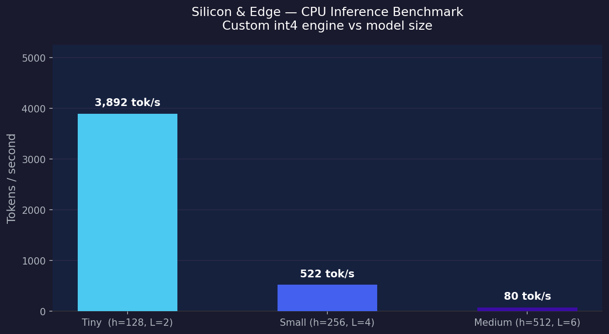

# Silicon & Edge — Custom LLM Inference Engine

> A lightweight LLM inference engine written in C++ with custom int4 quantization, built to run transformer models on edge devices with minimal RAM.

## Motivation

Existing frameworks (PyTorch, HuggingFace) are too heavy for edge deployment. This engine is designed to run Llama-3 architecture models on ≤4GB RAM by implementing every component from scratch — no deep learning framework dependency.

## Quantization Method

All weight matrices use symmetric per-channel 4-bit quantization:
- Each row gets its own float32 scale: scale = max(|row|) / 7
- Weights quantized to int4 range [-8, 7]
- Two int4 values packed into one uint8 byte (nibble packing)
- Result: 8x memory reduction vs float32, 4x vs float16

## Benchmark Results

| Model Size | Hidden | Layers | Tok/s (CPU, int4) |
|------------|--------|--------|-------------------|
| Tiny       | 128    | 2      | 3,892             |
| Small      | 256    | 4      | 522               |
| Medium     | 512    | 6      | 80                |

Hardware: Apple MacBook Air (M-series), CPU only, synthetic weights.

## Tech Stack

| Layer        | Technology                        |
|--------------|-----------------------------------|
| Engine       | C++20, -O3, -march=native         |
| GPU (Nvidia) | CUDA custom warp-shuffle kernel   |
| GPU (Apple)  | Metal Performance Shaders         |
| Weight export| Python + NumPy                    |
| Benchmarking | Python + Matplotlib               |

## Build & Run

Build the engine:
    make

Generate synthetic weights:
    python3 tools/gen_weights.py

Run benchmark:
    python3 benchmarks/run_bench.py

Run inference:
    ./build/silicon_edge --weights weights/small.bin --max-tokens 128

## Key Implementation Details

KV Cache — avoids recomputing attention for past tokens. Each layer maintains a fixed-size key/value buffer indexed by position.

RoPE (Rotary Position Embedding) — applied per attention head, encodes relative position into query/key vectors without learned embeddings.

SwiGLU FFN — feed-forward block uses gated activation: FFN(x) = SiLU(gate(x)) * up(x), then projected down. Used in Llama-3.

Warp-shuffle CUDA reduction — uses __shfl_down_sync for intra-warp dot product accumulation, avoiding shared memory overhead.

## Limitations & Future Work

- Real Llama-3 weights (currently synthetic)
- Flash Attention (reduce KV cache memory)
- AWQ calibration for better quantization quality
- Speculative decoding for higher throughput
- Metal GPU path validation on Apple Silicon
- Perplexity measurement to verify output quality

## Target Platforms

Nvidia — CUDA kernel targets sm_80 (A100/RTX 30xx). Warp-shuffle reduction eliminates shared memory bottleneck for small batch sizes typical in edge inference.

Apple — Metal shader designed for Apple Silicon unified memory architecture. On-device inference with no data leaving the device, aligned with Apple on-device AI privacy goals.
